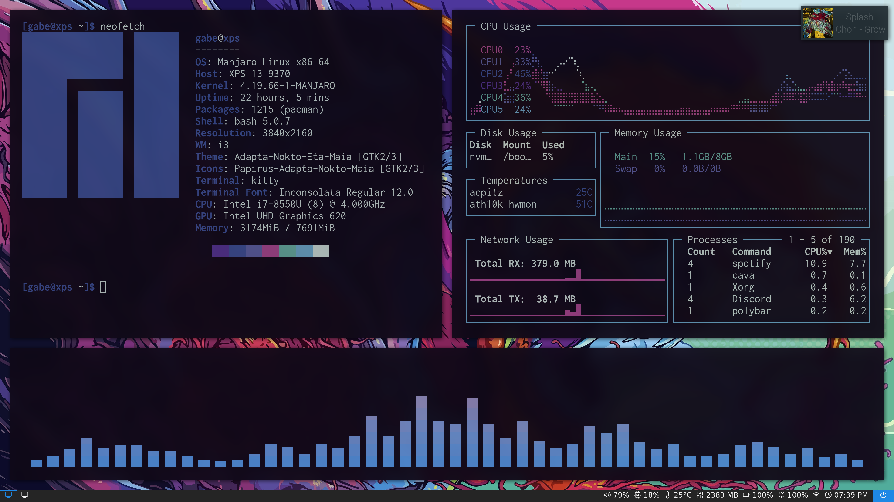

# Gabe's Dotfiles
My dotfiles for my Manjaro i3 laptop for school and programming

<h3 align = "center">

## Installation
You can easily create symlinks from this folder by running the install file by going into the directory and running 
```
./install
```
